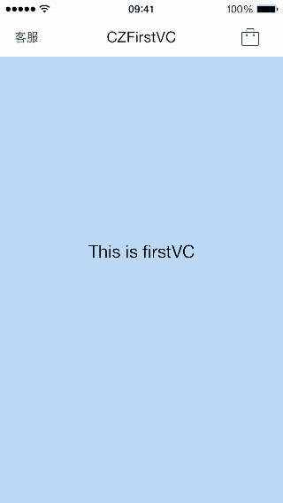

# CZNavigation
一个自定义的导航栏，由ViewController自己管理，但使用方式和系统的导航栏类似。



## Requirements
支持iOS8.0。

## Adding CZLinkLabel to your project
1. 将“CZNavigation”文件夹添加到项目中。
2. #import "CZNavigationController.h"


## Usage
基本使用
```
//设置导航栏的标题
self.navigationBar.title = @"CZFirstVC";

//设置导航栏左边的按钮
UIButton *leftButton = [[UIButton alloc] initWithFrame:CGRectZero];
[leftButton setTitle:@"客服" forState:UIControlStateNormal];
leftButton.titleLabel.font = [UIFont systemFontOfSize:14];
[leftButton setTitleColor:[UIColor blackColor] forState:UIControlStateNormal];
[leftButton sizeToFit];
self.navigationBar.leftButton = leftButton;

//设置导航栏右边的按钮
UIButton *rightButton = [[UIButton alloc] initWithFrame:CGRectZero];
[rightButton setImage:[UIImage imageNamed:@"gouwudai"] forState:UIControlStateNormal];
[rightButton sizeToFit];
[rightButton addTarget:self action:@selector(rightButtonAction) forControlEvents:UIControlEventTouchUpInside];
self.navigationBar.rightButton = rightButton;
```

隐藏导航栏
```
//导航栏的隐藏状态
BOOL isHidden = self.navigationBarHidden;

//以动画的方式隐藏导航栏
[self setNavigationBarHidden:YES animated:YES];
//或者 直接隐藏导航栏，没有动画
self.navigationBarHidden = YES;
```

Other
```
//禁用pop交互手势
CZNavigationController *navVC = (CZNavigationController *)self.navigationController;
navVC.enablePopGesture = NO;

//你可以重写vc的这个方法来监听当前控制器的返回操作
- (void)willBePopped {
    NSLog(@"将要pop返回上一个界面。。。");
}

//设置导航栏背景颜色
self.navigationBar.backgroundView.backgroundColor = [UIColor orangeColor];

//显示navBar底部线条,默认是隐藏的
self.navigationBar.line.hidden = NO;
```

## 注意
1. CZNavigation使用的是vc(ViewController)来管理navBar,每个vc都会有一个navBar。
2. navBar是被添加到ViewController的view上，所以你需要将子视图添加到navBar的下方，防止挡住navBar。
3. 不要使用UITableViewController和UICollectionViewController，因为它们的视图是会滑动的，导致无法固定navBar,你可以将UITableView和UICollectionView作为vc的子视图,达到相同的效果。


